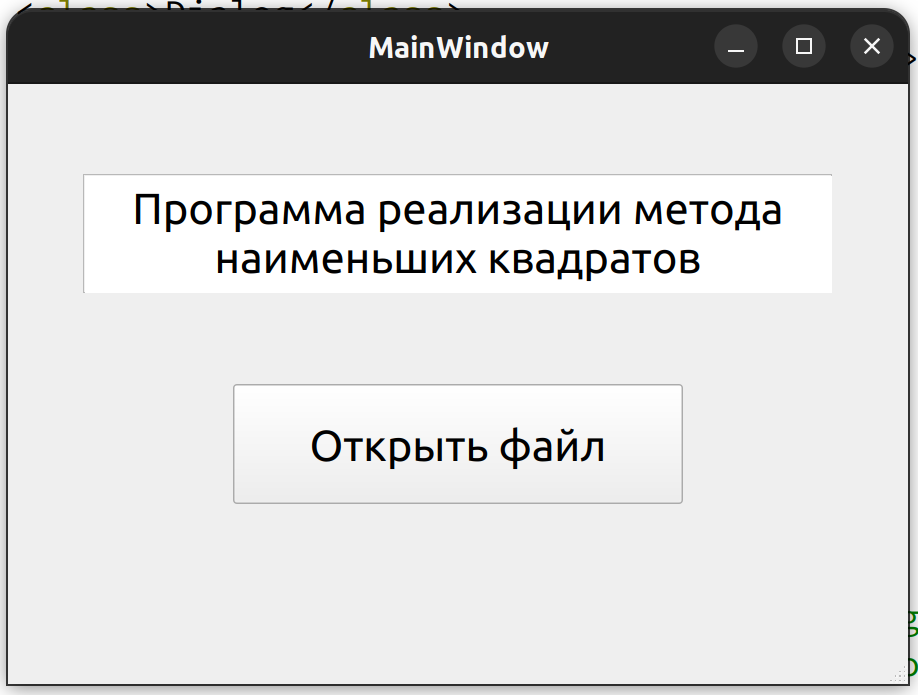
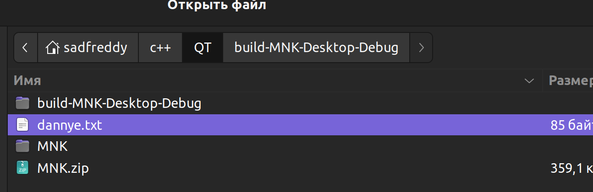
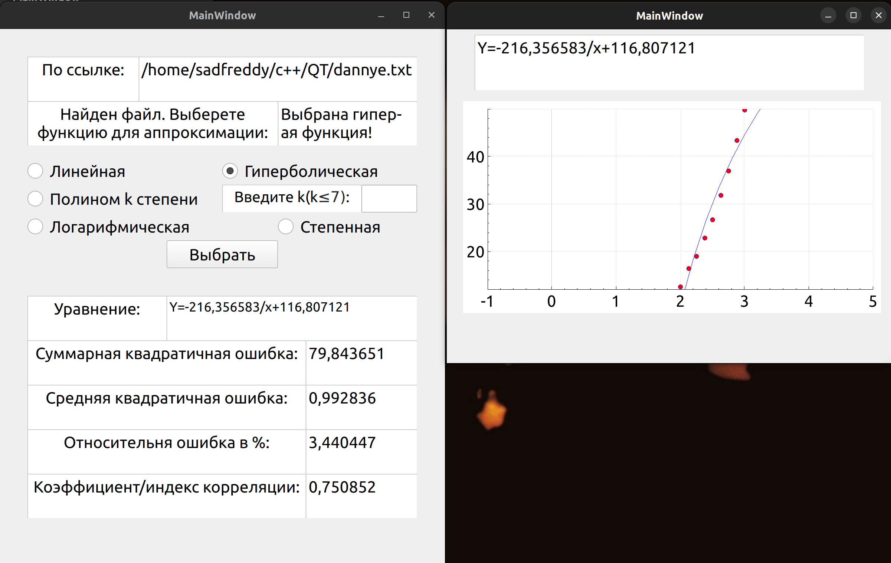
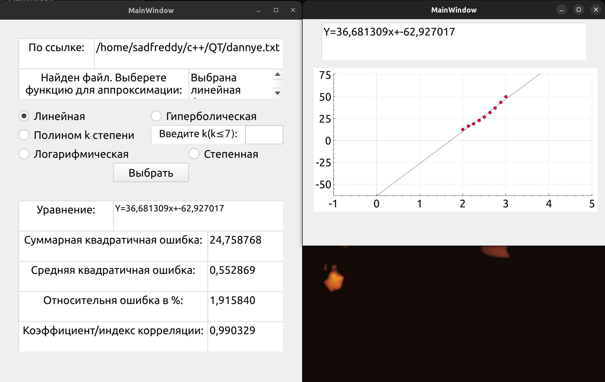
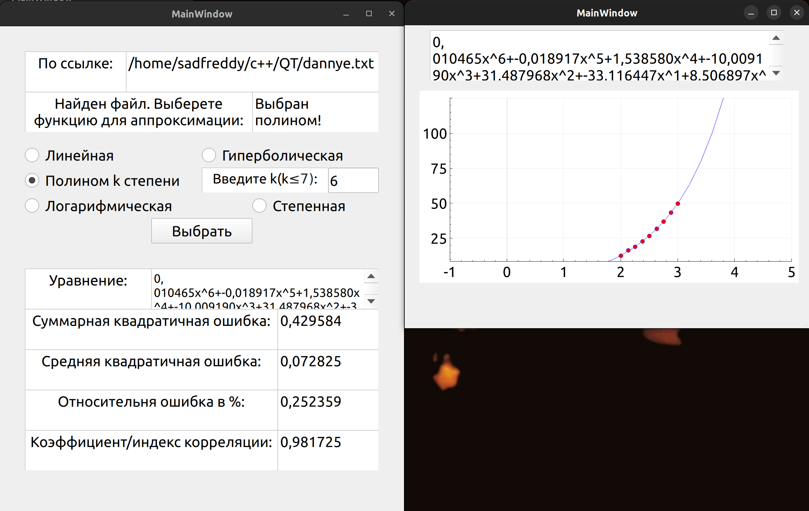
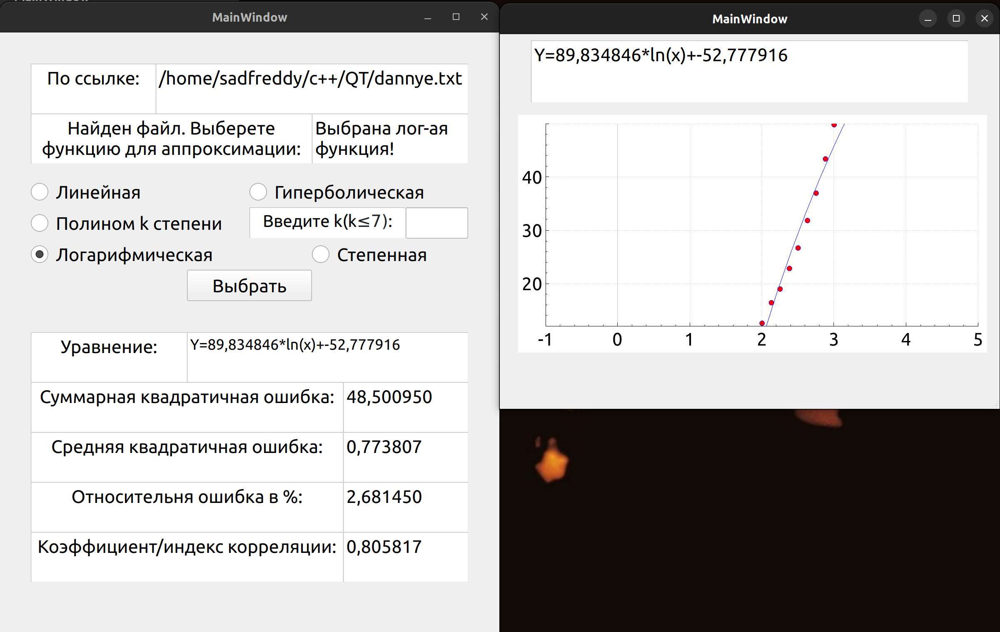
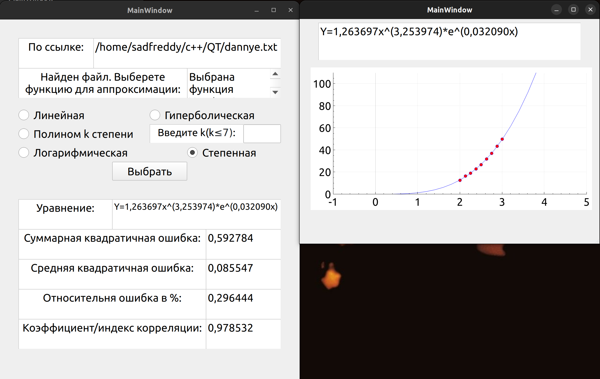

# Приложение "Метод наименьших квадратов"
## Vетод наименьших квадратов (МНК) — математический метод, применяемый для решения различных задач, основанный на минимизации суммы квадратов отклонений некоторых функций от экспериментальных входных данных. Он может использоваться для «решения» переопределенных систем уравнений (когда количество уравнений превышает количество неизвестных), для поиска решения в случае обычных (не переопределенных) нелинейных систем уравнений, для аппроксимации точечных значений некоторой функции. 
## Данный проект представляет собой GUI приложение, разработанное на фреймворке QT, с целью анализа вводимых данных и построения пяти аппроксимирующих функций. Кроме того, приложение вычисляет коэффициент или индекс корреляции, а также различные ошибки для каждой из построенных функций.

## Пример использования

## Функциональность приложения
### Пользователь выбирает файл для приложения, после чего выбирает нужные параметры и запускает процесс анализа. Приложение предоставляет следующую функциональность:

1. Ввод данных: пользователь имеет возможность выбрать файл с данными через диалоговое окно( формат данных: точки X, после них следуют соответствующие им значения Y)
2. Выбор параметров: пользователь может выбрать настройки для анализа данных, такие как тип аппроксимирующей функции, и в случае с полиномом его порядок.

3. Анализ данных: после ввода данных и выбора параметров приложение производит анализ введенных данных и вычисляет пять аппроксимирующих функций. Каждая функция будет представлена в виде графика.

4. Вычисление коэффициента корреляции: приложение вычисляет коэффициент корреляции (например, корреляцию Пирсона) для каждой аппроксимирующей функции, сравнивая ее с введенными данными.

5. Вычисление различных ошибок: приложение вычисляет различные ошибки аппроксимации, такие как среднеквадратическая ошибка (MSE), относительная ошибка и другие, для каждой аппроксимирующей функции.

## Установка и запуск приложения
### Для установки и запуска приложения на вашем компьютере необходимо выполнить следующие шаги:

1. Убедитесь, что на вашем компьютере установлен фреймворк QT версии 5.15.3 или выше. Если фреймворк не установлен, вы можете скачать его с официального сайта и следовать инструкциям по установке.

2. Склонируйте данный репозиторий на свой компьютер или скачайте его в виде ZIP архива.

3. Откройте проект в QT Creator или любой другой интегрированной среде разработки, которую вы предпочитаете.

4. При необходимости внесите необходимые настройки в файле конфигурации проекта.

5. Соберите и запустите проект.

6. Приложение будет запущено и будет доступно для использования.

#### Предупреждение: Данный проект не несет ответственности за возможные ущерб, причиненные использованием или неправильным использованием приложения. Пользователь использует приложение на свой страх и риск.
